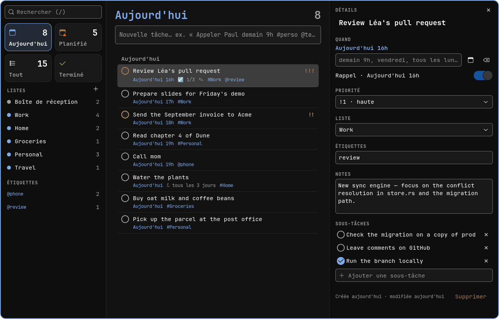

# Omado

A to-do app for [Omarchy](https://omarchy.org), in the spirit of Apple Reminders
and Todoist: native (GTK4), keyboard-first, and dressed in the colors of your
current Omarchy theme.



Omado speaks English, French, German, Spanish, Brazilian Portuguese, Russian,
Simplified Chinese, Japanese, Italian and Polish, and follows your system
language — quick entry included.

## Installation

```sh
./install.sh             # build, install into ~/.local, enable the reminder daemon
./install.sh --uninstall # remove everything except your tasks
```

You need Rust, GTK 4.16 or later and gettext (`pacman -S rust gtk4 gettext`). For the Hyprland
shortcuts, add this at the end of `~/.config/hypr/hyprland.lua`:

```lua
dofile(os.getenv("HOME") .. "/.local/share/omado/hypr/omado.lua")
```

You then get **Super+R** for quick entry (a floating window, wherever you are)
and **Super+Shift+R** to open Omado.

## Quick entry

Everything goes in the title, in your language:

```
Call Paul tomorrow 9am #personal @phone !1
Take out the trash every monday and thursday at 8pm #home
Pay rent every month on the 5th
Appeler Paul demain 9h #perso @tel !1
Müll rausbringen jeden Montag und Donnerstag um 20 Uhr
Llamar a mamá el viernes a las 6 de la tarde
Позвонить Павлу завтра в 9
明天下午3点开会 #工作
毎週月曜日と木曜日にゴミ出し
```

English, French, Russian, Chinese and Japanese are always understood; German,
Spanish, Italian, Portuguese and Polish when they are your interface language
(mixing all the Latin-script languages would misread titles: Spanish "2 o 3"
would become Polish "at 3").

| Part | Examples |
|---|---|
| Date | `today`, `tomorrow`, `friday`, `next friday`, `this weekend`, `next week`, `next month`, `Oct 15`, `15 October`, `the 15th`, `15/10`, `15.10.`, `2026-12-01`, `in 3 days`, `in 2 weeks` |
| Time | `9am`, `2pm`, `at 3` (afternoon), `14:30`, `noon`, `tonight`, `tomorrow morning`, `in 2h`, `in 30 min` |
| Repeat | `every day`, `every 3 days`, `every other week`, `every monday and thursday`, `mondays`, `every weekday`, `every weekend`, `monthly`, `yearly` |
| List | `#groceries` (created if it doesn't exist; `#home-office` finds "Home office") |
| Tag | `@phone`, `@home` |
| Priority | `!1` (high), `!2`, `!3`, or `p1`… `p3` |

…and their equivalents in each language (`übermorgen`, `a las 9`, `tra 3 giorni`,
`às segundas`, `через неделю`, `w poniedziałki`, `下周五`, `3日後`…).

A set time creates a reminder. A month on its own ("march", "may") is not taken
for a date, and `#123` or `a@b.com` stay in the title.
`omado parse "…"` shows what would be understood, without creating anything.

## Keyboard shortcuts

| Key | Action |
|---|---|
| `n` or `a`, `Ctrl+N` | New task |
| `/`, `Ctrl+F` | Search |
| `j` / `k` | Next / previous task |
| `x` | Complete / reopen |
| `e`, `Enter`, double-click | Open details |
| `d`, `Delete` | Delete |
| `u`, `Ctrl+Z` | Undo |
| `Alt+↑` / `Alt+↓` | Move the task within its list |
| `Ctrl+1` … `Ctrl+4` | Today, Scheduled, All, Completed |
| `Esc` | Close details, clear search |

In quick entry: `Enter` adds and closes, `Shift+Enter` adds and keeps the
window open, `Esc` closes.

## Command line

```sh
omado                       # open the app
omado quick                 # quick entry
omado add "Milk tomorrow #groceries"
omado ls                    # today; also upcoming, all, done, inbox, #list, @tag
omado ls all --json
omado search dentist
omado done 3f2a             # the start of the ID is enough
omado undo 3f2a
omado rm 3f2a
omado lists
```

## Omarchy integration

- **Theme**: colors come from `~/.local/state/omarchy/current/theme/colors.toml`,
  control opacities from `shell.toml`, corner rounding from Hyprland. An
  `omarchy theme set` applies immediately, without restarting Omado.
- **Font**: the system monospace font (`omarchy font set`).
- **Reminders**: `omado-daemon` runs as a systemd user service and goes through
  Omarchy's notification center. Notifications offer "Done", "+10 min" and
  "+1 h", and clicking one opens Omado.

## Languages

Omado picks its language like any Linux program: `LANGUAGE`, then `LC_ALL`,
`LC_MESSAGES` and `LANG`. To run it in another language than the rest of your
desktop, set `LANGUAGE`, e.g. `LANGUAGE=fr omado`.

Translations are gettext catalogs in `po/`, compiled into the binaries when
building. After changing strings in the code, run `po/update.sh`: it refreshes
`po/omado.pot` and merges it into each `.po`. To add a language, run
`msginit -i po/omado.pot -l xx -o po/xx.po` and add `xx` to `po/LINGUAS`; if
its plural rule differs from English, also add it to `plural_form` in
`crates/omado-core/src/i18n.rs` (a test will remind you).

## Architecture

```
crates/
├── omado-core     model, SQLite, quick entry, recurrences (tested: cargo test)
├── omado-cli      the `omado` binary
├── omado-daemon   the `omado-daemon` binary: reminders
└── omado-gtk      the `omado-gtk` binary: the GTK4 + Relm4 interface
packaging/         .desktop, icon, systemd service, Hyprland rules
po/                translations (gettext)
```

Tasks live in `~/.local/share/omado/omado.db` (SQLite, WAL mode), shared by all
three programs. To experiment without touching your real tasks:
`OMADO_DB=/tmp/test.db omado-gtk`.

Recurrences are stored as RRULEs and IDs are UUIDs, in preparation for CalDAV
(VTODO) sync.
